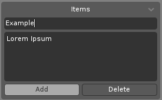
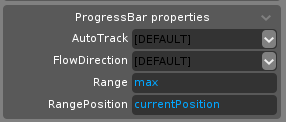

[← Back](../../index.md)

# Gui Lists
*Written by [The Red Builder](https://github.com/TheRedBuilder) with contributions from [Fagiano0](https://github.com/Fagiano0)*  
This list contains most gui things.

### CONTENTS:
- [Widget Types](#widget-types)
- [Lua Widget Types](#lua-widget-types)
- [Fonts](#fonts)

## Widget Types
This list contains every widget available in Scrap Mechanic and its function.
- Button 
	- An interactive Widget  
	- Button skins have 3 different states:
		- Inactive
		- Highlighted
		- Active
- Canvas
	- Empty widget
	- Can be used for rendering Mesh Previews
- ComboBox
	- Gives you a dropdown box with rewriteable text options  
	
- DDContainer
	- *Possibly Drag & Drop container?*
	> ***Note**: Doesnt work yet.*
- EditBox
	- Fancier version of TextBox
	- Supports better formatting and multiline
	- Text can be edited ingame, unless ReadOnly  
	
- ItemBox
	- *Possibly related to Drag & Drop container?*
	> ***Note**: Doesnt work yet.*
- ListBox
	- Lists all Items properties.  
	
- MenuBar
	- Automatically creates buttons from its Item property
	> ***Note**: Very limiting, lacks any SM-like skins. Mostly useless*
- MenuListBox
	- *???*
- PopupMenu
	- Automatically creates buttons from its Item property and adjusts its scale
	- Clicking any option makes it disappear
- ProgressBar
	- Visualizes progression
	- AutoTrack option works in Scrap Mechanic and makes it track infinitely  
	
	> ***Note**: You can't interact with it through lua.*
- ScrollBar
	- Lets you scroll in its range  
	> ***Note**: You can only set its callback through lua.*
- ScrollView
	- Adds 2 Scrollbars, that let you move around its own viewport
		- To set its size, use CanvasSize
		> ***Note**: CanvasSize is in Pixels only*
- ImageBox
	- Can be used to display tiled images
- TextBox
	- Basic textbox
	> ***Note**: More limiting than EditBox*
- TabControl
	- Widget with multiple tabs that player can switch between
	- Can have different widgets on every page
	- Pages are added from the Items property  
	
- Widget
	- Dummy Widget that only shows its Skin
- Window
	- Dragabble window that can be resized, depending on the skin
	> ***Note**: Only scales its viewport.*
	
## Lua Widget Types
Contains every Widget that must be created with Lua.
- Lua Dropdown
	- Works similarily to ListBox Widget, but better
	- Creation:
	```lua
	self.gui:createDropDown("DropdownHost", "cl_myFunction", {"Option1","Option2"}) -- change self.gui to your created gui, change "DropdownHost" to the name of your Widget (Widget should be empty, with panelEmpty skin), change "cl_myFunction" to the name of the function that will receive its callback, fill in the table {"Option1","Option2"} with the option names, these are returned to the callback when player clicks them.
	```
- Lua Sliders
	- Similar to ScrollBar Widget, but with improved functionality, at the cost of more skins
	- Creation:
	```lua
		--[[
			change "SliderHost" to the name of your Widget (should be empty, with panelEmpty skin)
			change "cl_myFunction" to the name of the function that will receive its callback
			change the first number (100) to the maximal value of the slider
			change the other number (50) to its starting value
		]]

		-- for horizontal slider:
		-- the boolean (true) controls if it should be numbered (exclusive to horiziontal)
		guiInterface:createHorizontalSlider("SliderHost", 100, 50, "cl_myFunction", true)
		
		
		-- for vertical slider:
		guiInterface:createVerticalSlider("SliderHost", 100, 50, "cl_myFunction")
	```

## Fonts
All the fonts available including their supported characters.

- All Characters
	- Default
	- SM_Header
	- SM_TextLabel
	- SM_LabelTiny
	- SM_SearchText
	- SM_ToolTipText
	- SM_Text
	- SM_TextSmall
	- SM_TextTiny
	- SM_ItemTitle
	- SM_ButtonTiny
	- SM_ButtonSmallBold
	- SM_UserName
	- SM_ListItem
	- SM_HotbarBinding
	- SM_IntlText
	- X_Hud_Alert
	- X_Hud_Interaction
	- X_Hud_PlayerName
	- DejaVuSansFontGenerated_13
	- DejaVuSansFontGenerated_15
	- DejaVuSansFontGenerated_28
- Other
	- SM_HeaderXLarge_Wide: `ADEFIMNOPRSTUV`
	- SM_HeaderLarge_Wide: `'ABCDEFGHIKLMNOPRSTUVWYZ`
	- SM_HeaderLarge_Medium: `!",./0123456789?ABCDEFGHIJKLMNOPRSTUVWXYZ\_abcdefghiklmnoprstuvwxy“”`
	- SM_HeaderLarge_Narrow: `ACDEGHMOS`
	- SM_HeaderMedium: `ABCDEGHILMNORSTUWY`
	- SM_SubHeader: `12345ACDEGILNORSTUVY\n`
	- SM_HeaderSmall: `!01ABCEGILNOPRSTUXaceiklmnostuv`
	- SM_HeaderTiny: `024:ABCDEGILMNOPRSTYemoprsu`
	- SM_Tab: `ACDEGHILMNOPRSTUY`
	- SM_TabSmall: `ABCDEIKLMNOPRSTUV`
	- SM_Label: `0123456789:EIMQTestu`
	- SM_LabelSmall: `DYabdegijmnoprstuwx`
	- SM_LabelMini: `0123456789ACDEILORSTVW`
	- SM_SliderLabel: `0123456789AFILMOSTWX`
	- SM_TextLarge: `!+,.:ABCDFGIMQSTUYZabcdefghijklmnoprstuvwyz’`
	- SM_TextDesc: `Sacehlnoprstw`
	- SM_GameName: `CGNaeghlmn`
	- SM_ButtonLarge: `ABCEFGHIKLMNOPRSTUX`
	- SM_Button: `ABCDEFIKLMNOPRSTUVWXY`
	- SM_ButtonSmall: `0123456789ABCDEFGHIKLMNOPRSTUVWXYZ[]abcefhiklmnoprstuw`
	- SM_NumberHuge: `0123456789:°`
	- SM_NumberSmall: `-0123456789:FNOTeim`
	- SM_NumberTiny: `*+-/0123456789:`
	- SM_NumberMini: `*/0123456789X`
	- SM_Digital: `0123456789:`
	- X_Interactable_Timer_TimeUnit: `MS`
	- X_Interactable_Timer_TickCount: `0123456789CIKST`
	- X_Interactable_LogicGate_Category: `BIacdeinrstv`
	- X_MenuGamemodeMenu_GameMode: `ACEGHILNRSTUV`
	- X_Hud_ItemStack: `0123456789`
	- HandbookTitle: '`ABCDEFGHILMNOPQRSTUVWY`
	- HandbookSubTitle: `&',-.35?ABCEFHILMNPRSTUWabcdefghijklmnopqrstuvwxy’•`
	- HandbookSubTitleItalic: `!',.ELTabcdefghiklmnoprstuvwxy`
	- HandbookPageCount: `/0123456789`
	- HandbookDescriptionLarge: `,.ABCIPSTabcdefghiklmnopqrstuvwyz`
	- HandbookDescriptionSmall: `!,-.:ABCEFHPQSTUWYabcdefghijklmnopqrstuvwxyz’`
	- HandbookInstructionLarge: `BCHIPabceiklmnorstuvy`
	- HandbookInstructionMedium: `/ACDHIJLMOPRSabcdeghijklmnoprstuv`
	- HandbookInstructionSmall: `ABCDHKLPRSTWabcdefghijklmnoprstuwy`
	- HandbookLogicDescription: `Aacdefghiklnorstvy`
	- HandbookFAQQuestion: `!,?HIMOWabcdefghilmnoprstuvwy`
	- HandbookFAQAnswer: `"()+,.ABHILMQRSTWYabcdefghiklmnoprstuvwyz`