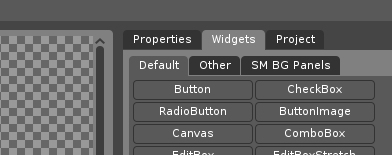
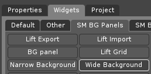
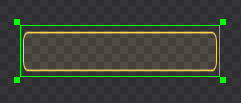
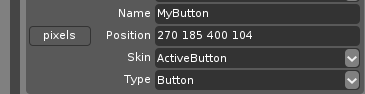
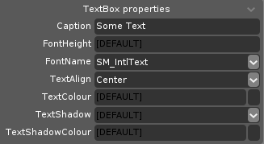
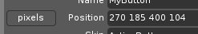
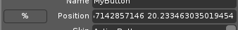

[← Back](../index.md)

# Gui Basics
*Written by [Fagiano0](https://github.com/Fagiano0)*  
In this tutorial you'll learn how to make a simple gui with a button that triggers code, while learning the basics in the process.

### CONTENTS:
- [Installing MyGui Editor](Gui-Basics#installing-mygui-editor)
- [Creating a Basic Gui](Gui-Basics#creating-a-basic-gui)
- [Accessing Your Gui with Code](Gui-Basics#accessing-your-gui-with-code)
- [General Advice](Gui-Basics#general-advice)

## Installing MyGui Editor
Before we can create our guis we're gonna need to install the MyGui editor.  
You can download a compiled version for Scrap Mechanic 0.6.x from __[here](https://drive.google.com/file/d/1URXmjUc9FogNdwKikct6otZ0N7tzWOC4/view?usp=sharing)__ (compiled and uploaded by [QuestionableMark](https://github.com/QuestionableM))

Once you've installed and unzipped it, open the `release` folder inside of it and open `LayoutEditor.exe`, you can also create a shortcut for easy access to it.

## Creating a Basic Gui
Now that you've opened the editor, let's create a basic gui.
On the right you will see there are multiple tabs, including `Widgets`, click it. The buttons here are used to select the type of widget you want to add, then to actually create it you have to click and drag your mouse inside of the gui (checkerboard pattern)   

> ***Note**: Some tabs like `Default`, `Other`, `SM BG Panels`, `SM Background`, etc. will only be visible if you expand the side panel.*



Again, for this tutorial we'll be making a gui with a button that triggers some code, so:
- Open the `SM BG Panels` tab and select `Wide Background`, then create it.  
    
- Now let's add a button by opening the `Default` tab in the `Widgets` tab and selecting `Button`.
- This time, when you create the button, drag your mouse *on top* of the background widget you placed earlier to make it a child of it.
- Switch to the `Properties` tab, here you can change properties about your widget, like the name which is useful for referencing widgets from code, the skin which determines the look of your widget, the text if the widget type and skin supports it, etc.
- Since we'll be referencing this button with code later, let's give it a name, in my case I'll call it `MyButton`.
- Now let's give our button a different look by changing its `Skin` to whatever you want, in my case I chose `Active Button` but you can choose whichever skin you want.  
     
- To add text to it, scroll down to the `TextBox Properties` and give it a `Caption` and `FontName`, the others are optional.  
    > ***Note**: The game doesn't load all characters for some fonts, unloaded characters will appear as* `⌧`.

    
- Now that we're almost done switch back to the `Properties` tab and select one of the widgets you added, you'll see a `Position` property with a `pixels` button to the left of it, you can click it to change the position mode and repeat it for all your widgets.  
    > ***Note**: You can change the position mode of widgets from `pixels` to `%` anytime, sometimes working with widgets in `%` might be more difficult or lead to misalignments. It is recommended to make all your widgets' position modes `%` after you're done working on the gui. The `%` mode is needed to make guis work correctly with different screen resolutions.*

      
    
- Great, now do `Ctrl`+`S` or press `File` and `Save` and navigate to your mod's folder, then save it somewhere in there. It is recommended to create a `Layouts` folder inside of the pre-existing `Gui` folder and save it there.

## Accessing Your Gui with Code
Now that we've made a gui, let's access it and make it interact with our code.  

The following example is a part script that opens the gui when interacted with and sends a message to the player when they press the button.
```lua
MyPart = class()

--Called when the part is created.
function MyPart:client_onCreate()
    --Creates the gui from the provided layout file, with some extra settings.
    --Change the path to where you put your gui layout file.
    self.gui = sm.gui.createGuiFromLayout( "$CONTENT_DATA/Gui/Layouts/CoolGui.layout", false, {
        isHud = false,
        isInteractive = true,
        needsCursor = true,
        hidesHotbar = false,
        isOverlapped = false,
        backgroundAlpha = 0.0,
    } )
    --Binds a callback to be called when the button is pressed.
    --Change "MyButton" to your button name.
    self.gui:setButtonCallback( "MyButton", "cl_onButtonPressed" )
end

--Called by the button and receives the buttonName.
function MyPart:cl_onButtonPressed(buttonName)
    --Sends a message to the player that pressed the button.
    sm.gui.chatMessage(buttonName.." pressed!")
end

--Called when the player interacts with this part.
function MyPart:client_onInteract(character, state)
    if state then
        --Opens the gui.
        self.gui:open()
    end
end
```

## General Advice
- You can press `Ctrl`+`T` to preview your gui in the editor.
- The `.layout` files produced by MyGui are actually just `.xml` files, you can manually edit them, a useful use case is duplicating widgets.
- Try to make your gui look *good* by avoiding the use of default MyGui skins or old sm skins and stretching widgets with skins that don't support it.
- Don't use skins ending in `_Dark`, they don't work in-game.